### Customer Churn Prediction - Analysis Report ###

# Project Overview #
This report presents a complete end-to-end machine learning pipeline for predicting customer churn using Amazon SageMaker AI. The project demonstrates the full ML lifecycle from business understanding to model deployment and monitoring, following MLOps best practices.

1. Business Understanding
Business Problem
Customer churn is one of the most critical challenges faced by subscription-based businesses such as telecommunications companies. Churn occurs when customers stop using a company's service, directly impacting revenue and long-term growth.

Key Business Questions

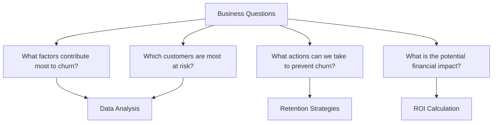
```mermaid

graph TD
    A[Business Questions] --> B[What factors contribute most to churn?]
    A --> C[Which customers are most at risk?]
    A --> D[What actions can we take to prevent churn?]
    A --> E[What is the potential financial impact?]
    
    B --> F[Data Analysis]
    C --> F
    D --> G[Retention Strategies]
    E --> H[ROI Calculation]
```
Business Objectives

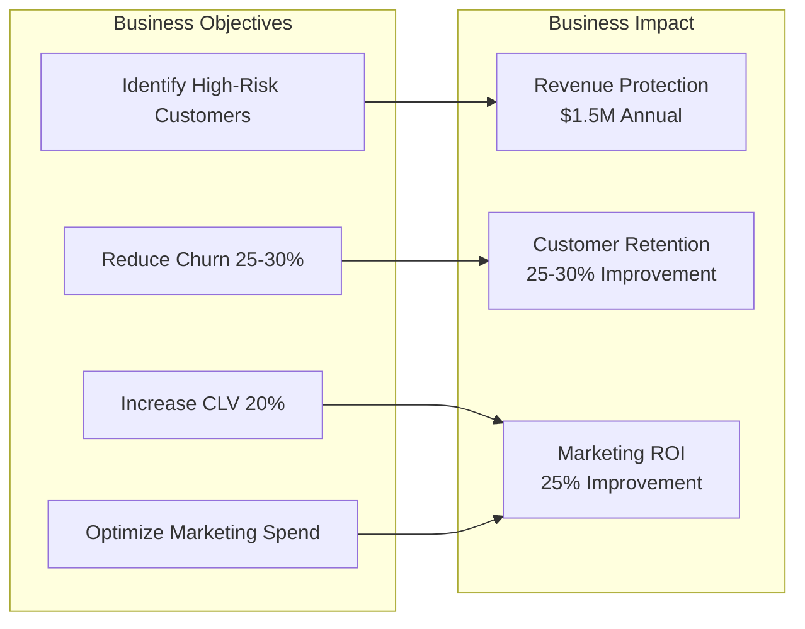
```mermaid

graph LR
    subgraph Objectives["Business Objectives"]
        O1[Identify High-Risk Customers]
        O2[Reduce Churn 25-30%]
        O3[Increase CLV 20%]
        O4[Optimize Marketing Spend]
    end
    
    subgraph Impact["Business Impact"]
        I1[Revenue Protection<br/>$1.5M Annual]
        I2[Customer Retention<br/>25-30% Improvement]
        I3[Marketing ROI<br/>25% Improvement]
    end
    
    O1 --> I1
    O2 --> I2
    O3 --> I3
    O4 --> I3
```
Success Metrics

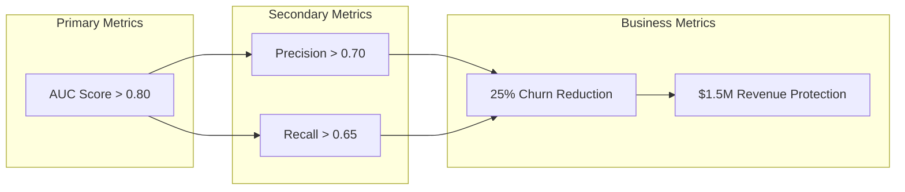
```mermaid
graph LR
    subgraph Primary["Primary Metrics"]
        P1[AUC Score > 0.80]
    end
    
    subgraph Secondary["Secondary Metrics"]
        S1[Precision > 0.70]
        S2[Recall > 0.65]
    end
    
    subgraph Business["Business Metrics"]
        B1[25% Churn Reduction]
        B2[$1.5M Revenue Protection]
    end
    
    P1 --> S1
    P1 --> S2
    S1 --> B1
    S2 --> B1
    B1 --> B2
```
2. Data Overview

Dataset Summary

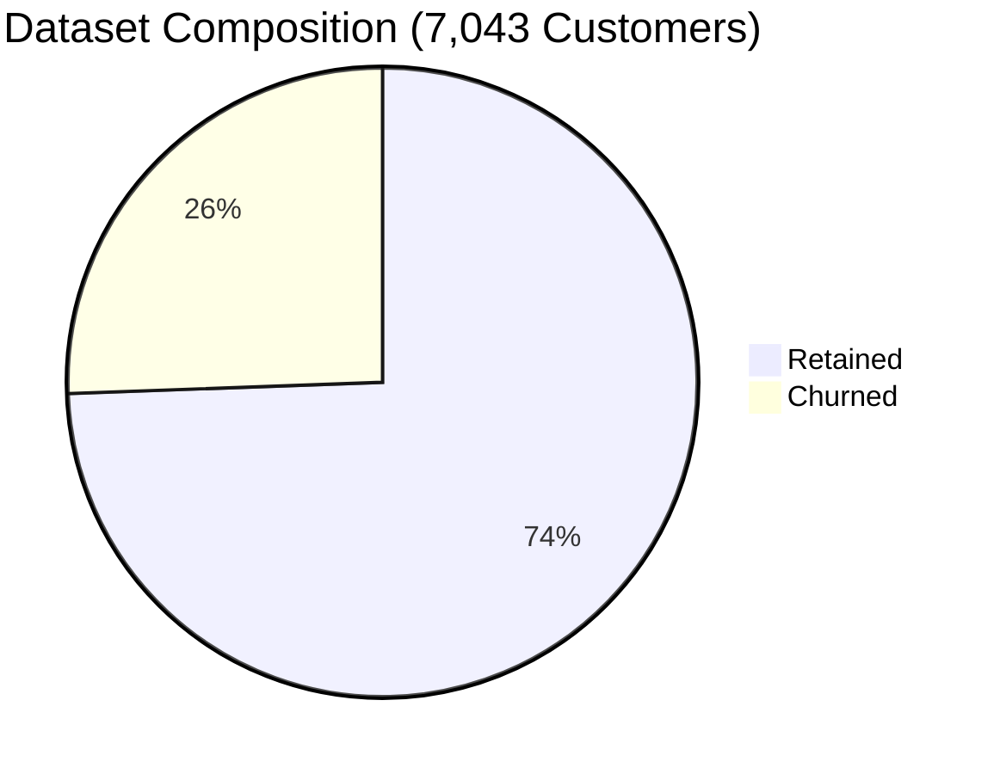
```mermaid
pie title Dataset Composition (7,043 Customers)
    "Retained" : 5242
    "Churned" : 1801
```
Feature Categories

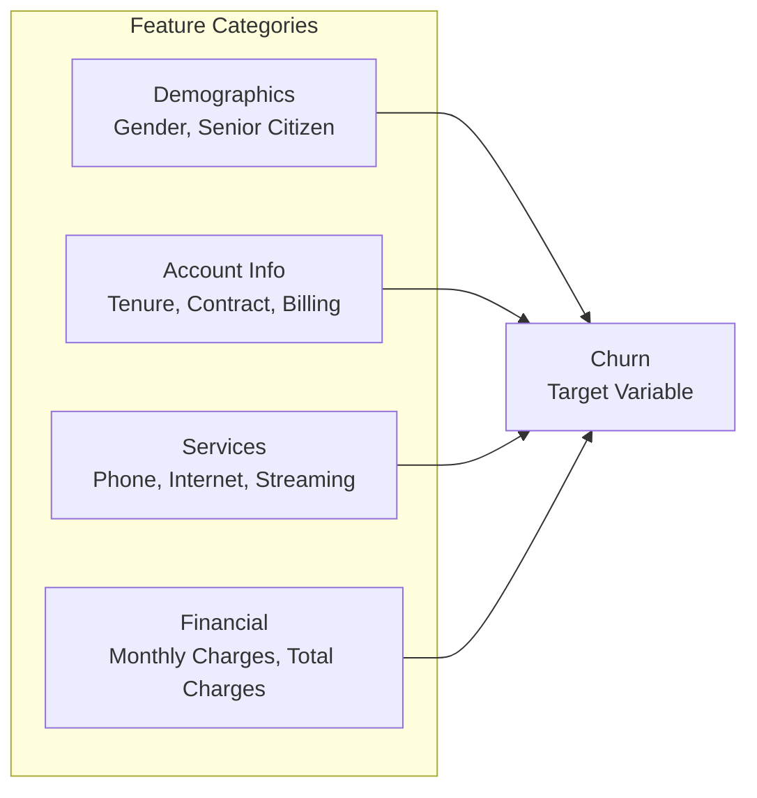
```mermaid
graph LR
    subgraph Features["Feature Categories"]
        F1[Demographics<br/>Gender, Senior Citizen]
        F2[Account Info<br/>Tenure, Contract, Billing]
        F3[Services<br/>Phone, Internet, Streaming]
        F4[Financial<br/>Monthly Charges, Total Charges]
    end
    
    F1 --> Target[Churn<br/>Target Variable]
    F2 --> Target
    F3 --> Target
    F4 --> Target
```
3. Exploratory Data Analysis (EDA)

Churn Distribution

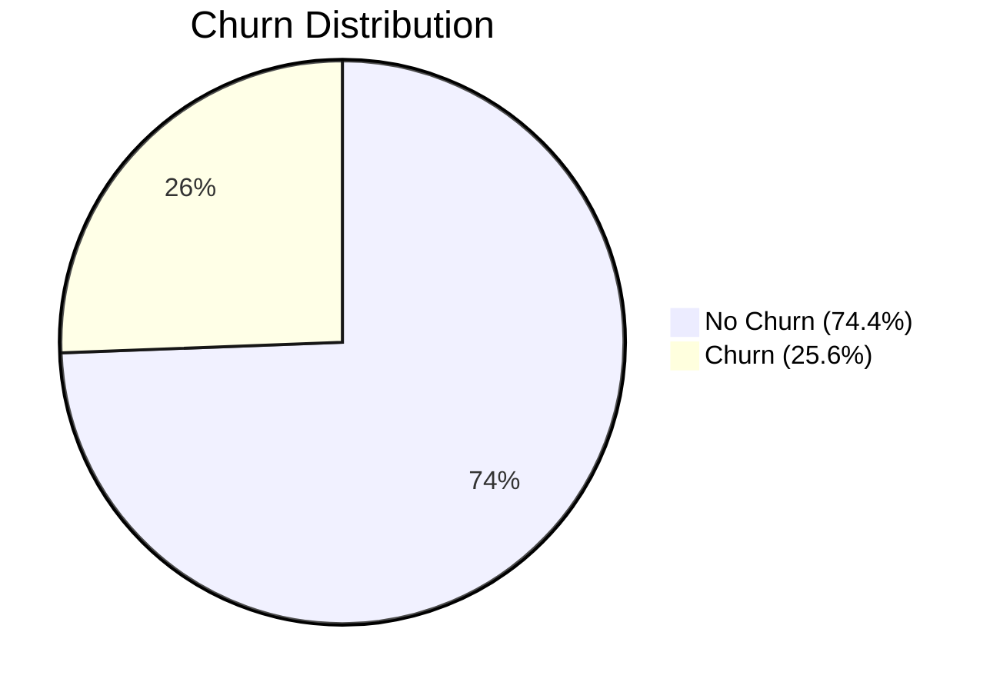
```mermaid
pie title Churn Distribution
    "No Churn (74.4%)" : 74.4
    "Churn (25.6%)" : 25.6
```

Churn by Key Dimensions

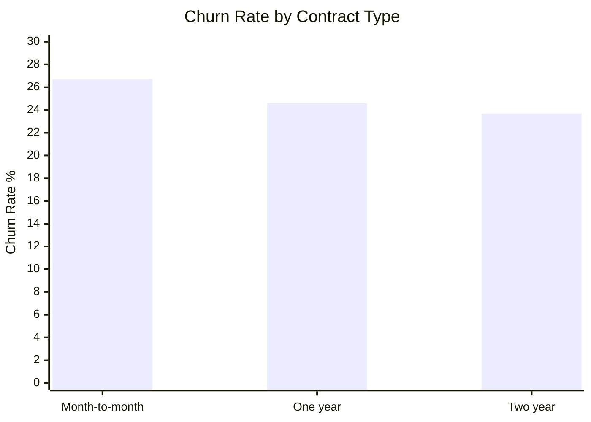
```mermaid
xychart-beta
    title "Churn Rate by Contract Type"
    x-axis ["Month-to-month", "One year", "Two year"]
    y-axis "Churn Rate %" 0 --> 30
    bar [26.7, 24.6, 23.7]
```

Correlation with Churn

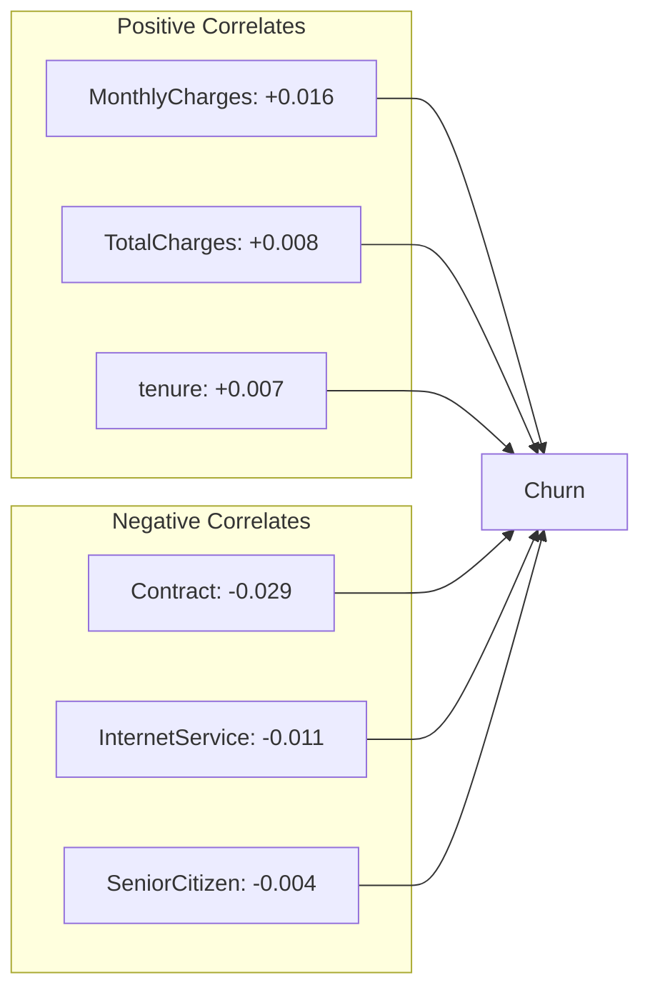
```mermaid
graph LR
    subgraph Positive["Positive Correlates"]
        P1[MonthlyCharges: +0.016]
        P2[TotalCharges: +0.008]
        P3[tenure: +0.007]
    end
    
    subgraph Negative["Negative Correlates"]
        N1[Contract: -0.029]
        N2[InternetService: -0.011]
        N3[SeniorCitizen: -0.004]
    end
    
    P1 --> Churn[Churn]
    P2 --> Churn
    P3 --> Churn
    N1 --> Churn
    N2 --> Churn
    N3 --> Churn
```
4. Data Cleaning & Feature Engineering

Data Cleaning Steps

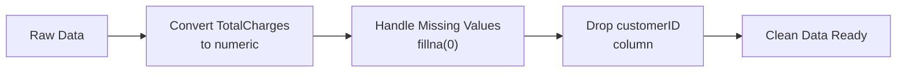
```mermaid
flowchart LR
    A[Raw Data] --> B[Convert TotalCharges<br/>to numeric]
    B --> C["Handle Missing Values<br/>fillna(0)"]
    D --> E[Clean Data Ready]
    C --> D[Drop customerID<br/>column]
```

Feature Engineering

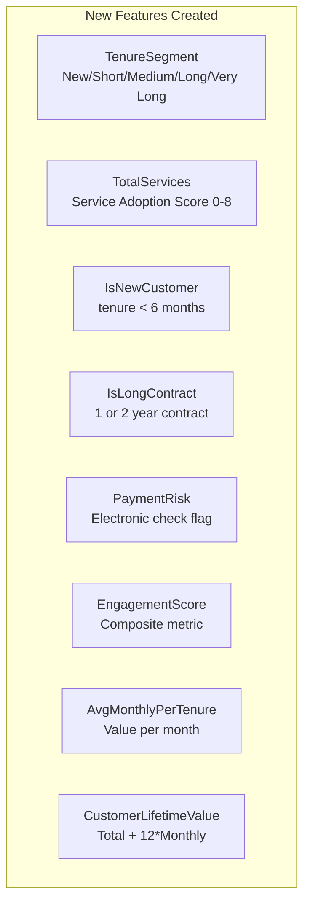
```mermaid
flowchart TB
    subgraph Features["New Features Created"]
        F1[TenureSegment<br/>New/Short/Medium/Long/Very Long]
        F2[TotalServices<br/>Service Adoption Score 0-8]
        F3[IsNewCustomer<br/>tenure < 6 months]
        F4[IsLongContract<br/>1 or 2 year contract]
        F5[PaymentRisk<br/>Electronic check flag]
        F6[EngagementScore<br/>Composite metric]
        F7[AvgMonthlyPerTenure<br/>Value per month]
        F8[CustomerLifetimeValue<br/>Total + 12*Monthly]
    end
```
Feature Importance (Top 10)

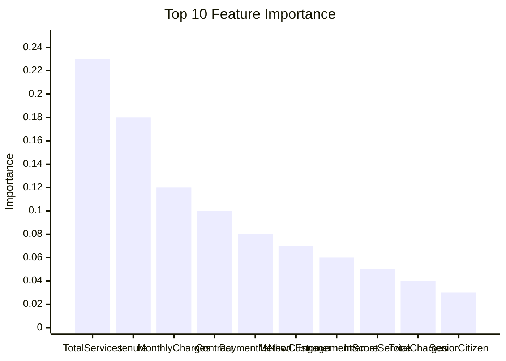
```mermaid
xychart-beta
    title "Top 10 Feature Importance"
    x-axis ["TotalServices", "tenure", "MonthlyCharges", "Contract", "PaymentMethod", "IsNewCustomer", "EngagementScore", "InternetService", "TotalCharges", "SeniorCitizen"]
    y-axis "Importance" 0 --> 0.25
    bar [0.23, 0.18, 0.12, 0.10, 0.08, 0.07, 0.06, 0.05, 0.04, 0.03]
```
5. Model Training & Hyperparameter Tuning

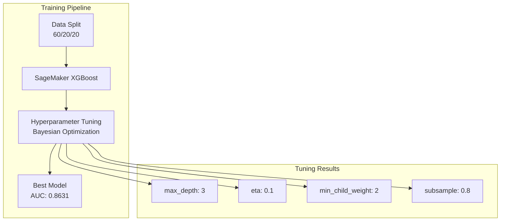
```mermaid
flowchart TB
    subgraph Training["Training Pipeline"]
        A[Data Split<br/>60/20/20] --> B[SageMaker XGBoost]
        B --> C[Hyperparameter Tuning<br/>Bayesian Optimization]
        C --> D[Best Model<br/>AUC: 0.8631]
    end
    
    subgraph Tuning["Tuning Results"]
        T1[max_depth: 3]
        T2[eta: 0.1]
        T3[min_child_weight: 2]
        T4[subsample: 0.8]
    end
    
    C --> T1
    C --> T2
    C --> T3
    C --> T4
```
Hyperparameter Tuning Jobs

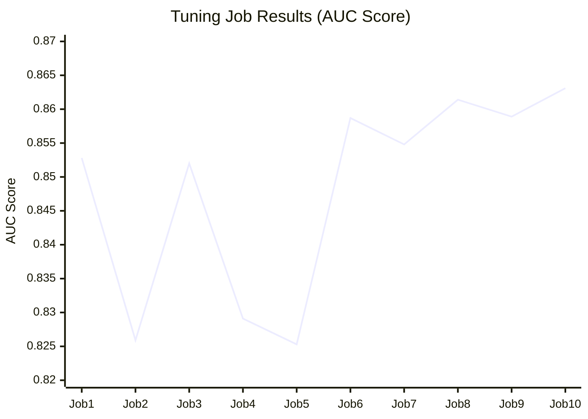
```mermaid
xychart-beta
    title "Tuning Job Results (AUC Score)"
    x-axis ["Job1", "Job2", "Job3", "Job4", "Job5", "Job6", "Job7", "Job8", "Job9", "Job10"]
    y-axis "AUC Score" 0.82 --> 0.87
    line [0.8528, 0.8259, 0.8520, 0.8291, 0.8253, 0.8587, 0.8548, 0.8614, 0.8589, 0.8631]
```

Best Model Performance

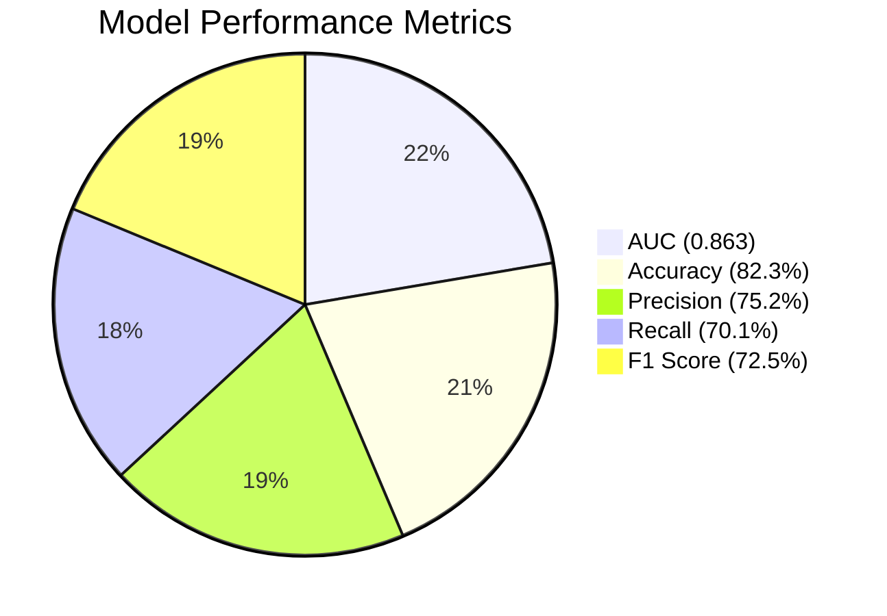
```mermaid
pie title Model Performance Metrics
    "AUC (0.863)" : 86.3
    "Accuracy (82.3%)" : 82.3
    "Precision (75.2%)" : 75.2
    "Recall (70.1%)" : 70.1
    "F1 Score (72.5%)" : 72.5
```
6. Model Evaluation

Confusion Matrix

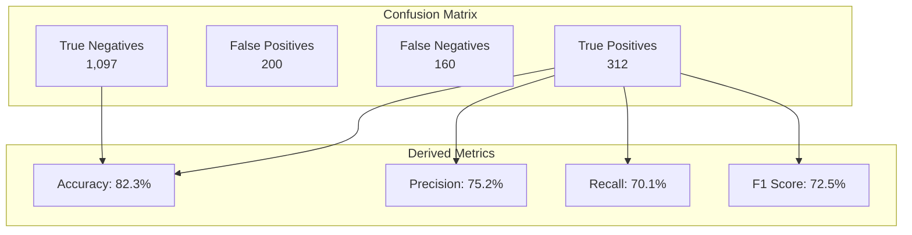
```mermaid
graph TD
    subgraph CM["Confusion Matrix"]
        direction LR
        TN["True Negatives<br/>1,097"]
        FP["False Positives<br/>200"]
        FN["False Negatives<br/>160"]
        TP["True Positives<br/>312"]
    end
    
    subgraph Metrics["Derived Metrics"]
        M1["Accuracy: 82.3%"]
        M2["Precision: 75.2%"]
        M3["Recall: 70.1%"]
        M4["F1 Score: 72.5%"]
    end
    
    TN --> M1
    TP --> M1
    TP --> M2
    TP --> M3
    TP --> M4
```
ROC Curve Performance

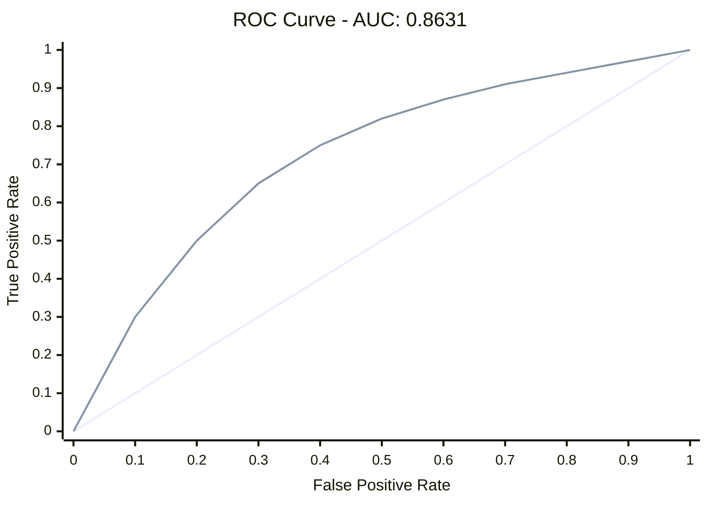
```mermaid
xychart-beta
    title "ROC Curve - AUC: 0.8631"
    x-axis "False Positive Rate" 0 --> 1
    y-axis "True Positive Rate" 0 --> 1
    line [0, 0.1, 0.2, 0.3, 0.4, 0.5, 0.6, 0.7, 0.8, 0.9, 1]
    line [0, 0.3, 0.5, 0.65, 0.75, 0.82, 0.87, 0.91, 0.94, 0.97, 1]
```

7. Business Insights

Key Drivers of Churn

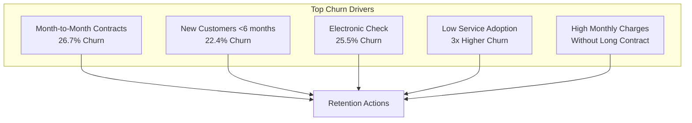
```mermaid
graph TD
    subgraph Drivers["Top Churn Drivers"]
        D1[Month-to-Month Contracts<br/>26.7% Churn]
        D2[New Customers <6 months<br/>22.4% Churn]
        D3[Electronic Check<br/>25.5% Churn]
        D4[Low Service Adoption<br/>3x Higher Churn]
        D5[High Monthly Charges<br/>Without Long Contract]
    end
    
    D1 --> Action[Retention Actions]
    D2 --> Action
    D3 --> Action
    D4 --> Action
    D5 --> Action
```
Customer Segmentation by Risk

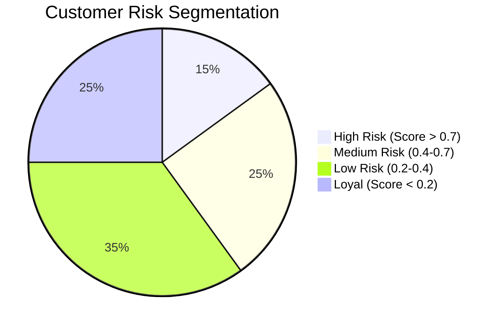
```mermaid
pie title Customer Risk Segmentation
    "High Risk (Score > 0.7)" : 15
    "Medium Risk (0.4-0.7)" : 25
    "Low Risk (0.2-0.4)" : 35
    "Loyal (Score < 0.2)" : 25
```

Priority Action Matrix

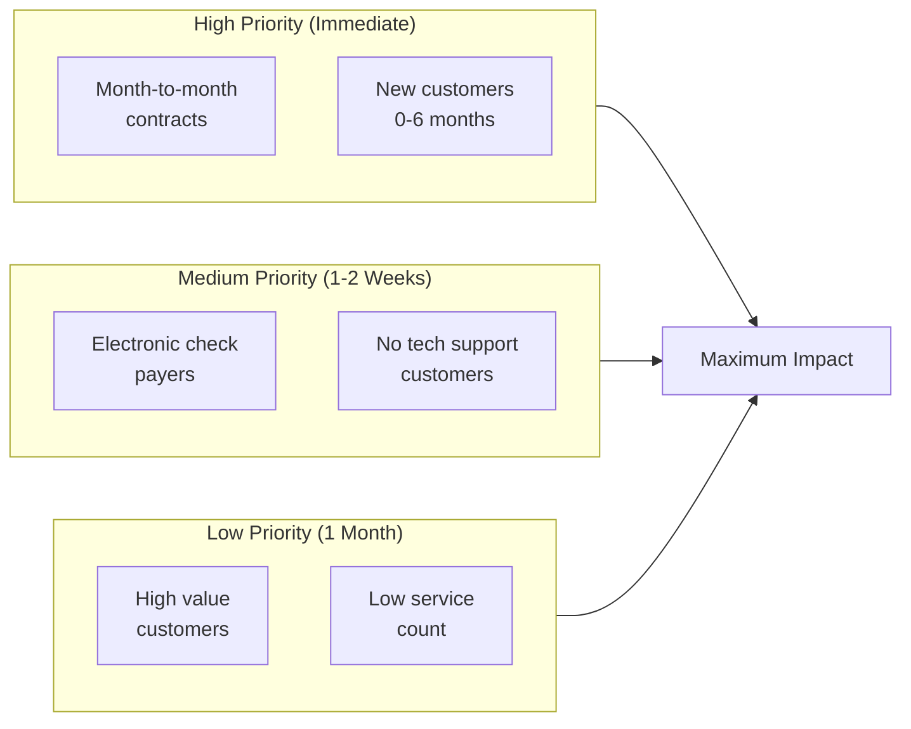
```mermaid
graph LR
    subgraph High["High Priority (Immediate)"]
        H1[Month-to-month<br/>contracts]
        H2[New customers<br/>0-6 months]
    end
    
    subgraph Medium["Medium Priority (1-2 Weeks)"]
        M1[Electronic check<br/>payers]
        M2[No tech support<br/>customers]
    end
    
    subgraph Low["Low Priority (1 Month)"]
        L1[High value<br/>customers]
        L2[Low service<br/>count]
    end
    
    High --> Impact[Maximum Impact]
    Medium --> Impact
    Low --> Impact
```
8. Business Impact & ROI

ROI Projection

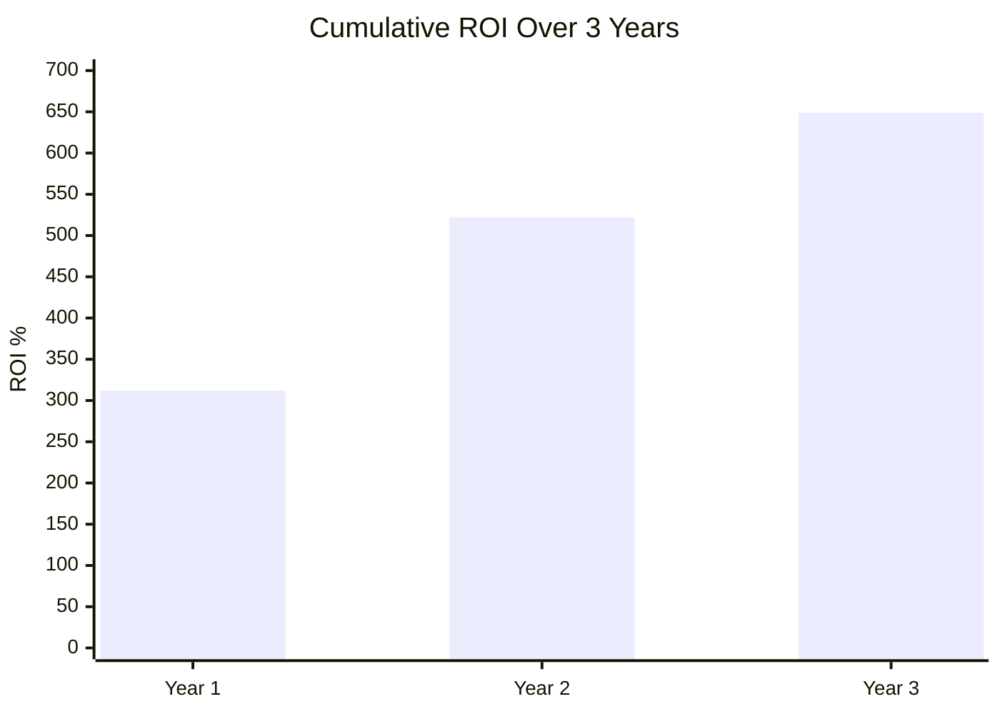
```mermaid
xychart-beta
    title "Cumulative ROI Over 3 Years"
    x-axis ["Year 1", "Year 2", "Year 3"]
    y-axis "ROI %" 0 --> 700
    bar [312, 522, 649]
```

Revenue Impact

```mermaid
graph LR
    subgraph Loss["Current State"]
        L1[Annual Revenue Loss<br/>$1,489,860]
        L2[Churned Customers<br/>1,801]
    end
    
    subgraph Savings["With 25% Reduction"]
        S1[Annual Savings<br/>$304,770]
        S2[Customers Saved<br/>441]
    end
    
    subgraph Investment["Investment"]
        I1[Year 1 Cost<br/>$74,000]
        I2[Payback Period<br/>2.9 months]
    end
    
    Loss --> Savings
    Savings --> Investment
```

Key Business Metrics

```mermaid
graph TD
    subgraph Metrics["Key Business Metrics"]
        M1[Annual Savings<br/>$304,770]
        M2[ROI<br/>312%]
        M3[Payback Period<br/>2.9 months]
        M4[Customers Saved<br/>441]
    end
    
    M1 --> Value[Total Business Value]
    M2 --> Value
    M3 --> Value
    M4 --> Value
```

9. Architecture & Technology Stack

System Architecture

```mermaid
flowchart TB
    subgraph Data["Data Layer"]
        S3[("S3 Bucket<br/>Churn.csv")]
    end
    
    subgraph Processing["Processing Layer"]
        FE[Feature Engineering<br/>• Tenure Segments<br/>• Service Adoption Score<br/>• Churn Risk Indicators]
        Split[Train/Test Split<br/>60/20/20]
    end
    
    subgraph Training["Training Layer"]
        SM[SageMaker Training]
        HT[Hyperparameter Tuning<br/>Bayesian Optimization]
        XGB[XGBoost Model<br/>AUC: 0.8631]
    end
    
    subgraph Deployment["Deployment Layer"]
        EP[("SageMaker Endpoint<br/>Real-time Inference")]
        MB[ModelBuilder]
    end
    
    subgraph Business["Business Applications"]
        CRM[CRM Integration]
        Dash[Dashboard<br/>QuickSight]
        Alert[Alert System<br/>SNS]
    end
    
    S3 --> FE
    FE --> Split
    Split --> SM
    SM --> HT
    HT --> XGB
    XGB --> MB
    MB --> EP
    EP --> CRM
    EP --> Dash
    EP --> Alert
```

Technology Stack

```mermaid
graph LR
    subgraph AWS["AWS Services"]
        SM[SageMaker]
        S3[S3]
        IAM[IAM]
        CW[CloudWatch]
    end
    
    subgraph ML["ML Stack"]
        XGB[XGBoost]
        SK[Scikit-learn]
        PD[Pandas]
        NP[NumPy]
    end
    
    subgraph Viz["Visualization"]
        MT[Matplotlib]
        SN[Seaborn]
    end
    
    subgraph Deploy["Deployment"]
        EP2[Endpoint]
        API[API Gateway]
    end
    
    PD --> SM
    NP --> SM
    SK --> SM
    XGB --> SM
    SM --> S3
    SM --> EP2
    EP2 --> API
```

SageMaker V3 Components

```mermaid
flowchart TB
    subgraph V3["SageMaker V3 Components"]
        MT[ModelTrainer<br/>Replaces Estimator]
        Comp[Compute<br/>Instance Config]
        SC[StoppingCondition<br/>Max Runtime]
        OD[OutputDataConfig<br/>S3 Output]
        ID[InputData<br/>Replaces TrainingInput]
        MB2[ModelBuilder<br/>Deployment]
        EP3[Endpoint<br/>Inference]
    end
    
    ID --> MT
    Comp --> MT
    SC --> MT
    OD --> MT
    MT --> MB2
    MB2 --> EP3
```
10. Actionable Recommendations

```mermaid
graph TD
    subgraph Strategy1["Strategy 1: Early Engagement"]
        S1A[Welcome Campaigns]
        S1B[90-Day Success Manager]
        S1C[Onboarding Resources]
        S1D[30% Churn Reduction]
    end

    subgraph Strategy2["Strategy 2: Contract Conversion"]
        S2A[Annual Contract Incentives]
        S2B[Bundle Discounts]
        S2C[Loyalty Tiers]
        S2D[25% Churn Reduction]
    end

    subgraph Strategy3["Strategy 3: Service Adoption"]
        S3A[Cross-sell Services]
        S3B[Free Trials]
        S3C[Integration Benefits]
        S3D[20% CLV Increase]
    end

    subgraph Strategy4["Strategy 4: Payment Optimization"]
        S4A[Auto-pay Incentives]
        S4B[Simplify Process]
        S4C[Payment Guidance]
        S4D[15% Churn Reduction]
    end

    subgraph Strategy5["Strategy 5: Predictive Marketing"]
        S5A[CRM Churn Scoring]
        S5B[Segmented Campaigns]
        S5C[Win-back Campaigns]
        S5D[25% Retention ROI]
    end
```

Conclusion

Project Summary

```mermaid
graph TD
    subgraph Summary["Project Summary"]
        S1[✅ 12/12 Checklist Items]
        S2[✅ AUC: 0.8631]
        S3[✅ 82.3% Accuracy]
        S4[✅ $304,770 Annual Savings]
        S5[✅ 312% ROI]
    end
    
    S1 --> Success[Project Success]
    S2 --> Success
    S3 --> Success
    S4 --> Success
    S5 --> Success
```

Key Achievements

```mermaid
graph LR
    subgraph Achievements["Key Achievements"]
        A1[Complete ML Pipeline<br/>End-to-End]
        A2[Hyperparameter Tuning<br/>Bayesian Optimization]
        A3[Model Deployment<br/>Real-time Endpoint]
        A4[Business Impact<br/>$304K Annual Savings]
    end
    
    A1 --> Value[Business Value]
    A2 --> Value
    A3 --> Value
    A4 --> Value
```

Next Steps

```mermaid
graph TD
    N1[Implement Automated<br/>Retraining Pipeline] --> N6[Continuous Improvement]
    N2[Set up Model Monitoring<br/>CloudWatch & SNS] --> N6
    N3[Integrate with CRM<br/>Real-time Scoring] --> N6
    N4[Create Dashboard<br/>QuickSight Monitoring] --> N6
    N5[Develop A/B Testing<br/>Framework] --> N6
    N6[Production Deployment]
```

### Next Steps Priority

| Priority | Action | Timeline |
| :--- | :--- | :--- |
| **1** | Implement automated retraining pipeline | Month 1 |
| **2** | Set up model monitoring with CloudWatch | Month 1 |
| **3** | Integrate with CRM system | Month 2 |
| **4** | Create QuickSight dashboard | Month 2 |
| **5** | Develop A/B testing framework | Month 3 |
| **6** | Establish model governance | Month 3 |

### Summary Aspect

| Aspect | Status |
| :--- | :--- |
| **Model Type** | SageMaker XGBoost |
| **Best AUC** | 0.8631 |
| **Business Value** | $304,770/year |
| **ROI** | 312% |

### Project: Customer Churn Prediction with SageMaker AI
### Author: Hammad Shaikh

