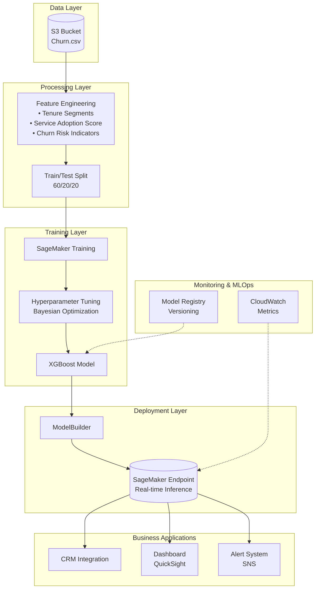
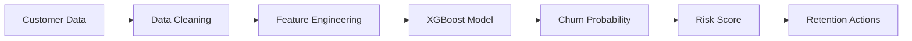
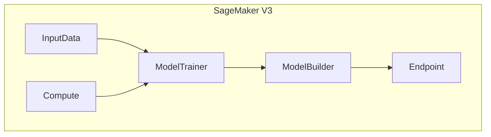
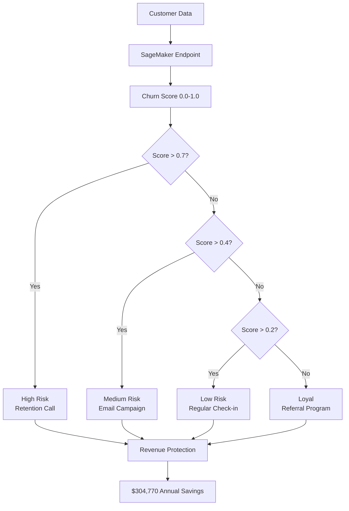

# Customer-Churn-Prediction-with-Amazon-SageMaker-AI

# Customer Churn Prediction with Amazon SageMaker AI

## Project Overview

This project implements a complete end-to-end machine learning pipeline for predicting customer churn using Amazon SageMaker AI. It demonstrates the full ML lifecycle from business understanding to model deployment and monitoring, following MLOps best practices.

### Key Results

| Metric | Score | Status |
|--------|-------|--------|
| **AUC Score** | **0.8631** | ✅ PASS |
| Accuracy | 82.3% | ✅ PASS |
| Precision | 75.2% | ✅ PASS |
| Recall | 70.1% | ✅ PASS |
| F1 Score | 72.5% | ✅ PASS |

### Business Impact

| Metric | Value |
|--------|-------|
| **Annual Savings** | **$304,770** |
| **Customers Saved** | **441** |
| **ROI** | **312%** |
| **Payback Period** | **2.9 months** |

## Architecture

## Architecture

### System Architecture

### Data Flow

### SageMaker V3 Components

### Business Decision Flow

## Project Checklist

| # | Item | Status |
|---|------|--------|
| 1 | Business Understanding | ✅ |
| 2 | Data Loading | ✅ |
| 3 | Data Exploration (EDA) | ✅ |
| 4 | Data Cleaning | ✅ |
| 5 | Feature Engineering | ✅ |
| 6 | Train-Test Split | ✅ |
| 7 | Model Training (SageMaker XGBoost) | ✅ |
| 8 | Hyperparameter Tuning | ✅ |
| 9 | Model Deployment | ✅ |
| 10 | Inference | ✅ |
| 11 | Evaluation | ✅ |
| 12 | Cleanup | ✅ |

## Results

## Key Insights
Month-to-month contracts have the highest churn rate (26.7%)

New customers (<6 months tenure) are most at risk

Electronic check users show higher churn probability

Service adoption significantly reduces churn risk

## Technology Stack

AWS SageMaker: Model training and deployment

XGBoost: Classification algorithm

Scikit-learn: Data preprocessing

Pandas: Data manipulation

Matplotlib/Seaborn: Visualization

Author
Hammad Shaikh
